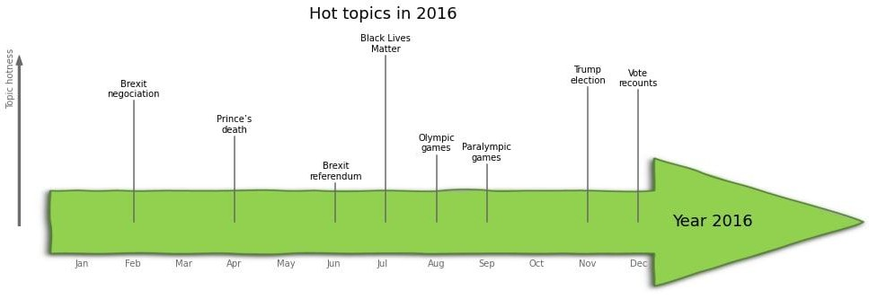
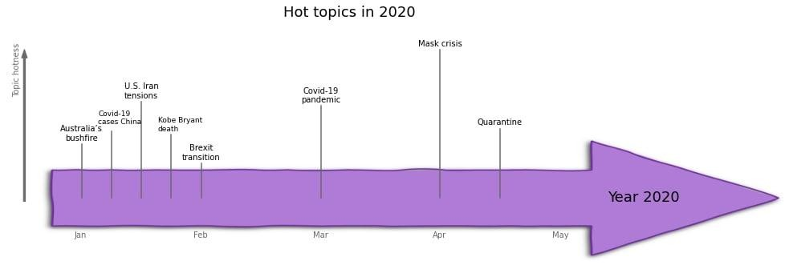

# Creating an event time-line from 2015 to 2020 using only newspaper quotes

Thank you for visiting our website! We, the ADAventurers, are happy to present the outcome of our project.

The ADAventurers: Lucas Brunschwig, John Mavrothalassitis, Axelle Piguet, Ester Simkova
### Project context and research questions

This project was done in the context of the Applied Data Analysis course at EPFL given by professor Robert West. 
We were provided with the [Quotebank dataset](https://zenodo.org/record/4277311#.YbntzrvTWV4), containing newspaper quotes from January 2015 to April 2020.

### Objectives

Using this dataset, the research questions we asked ourselves were the following :

1. Are newspapers’ quotes representative of events occurring in the world ? Meaning, can we deduce a time-line of important events that happened in the world during a certain time-frame only from topics emerging from newspaper quotes ?

2. When an important event occurs, does the general sentiment from newspaper quotes regarding the topic evolve ?

### Methods

#### Finding topics from quotes

The Quotebank dataset provides more than 100 millions quotes over 12 years. We decided to focus on the years 2015-2020. For each of these years, we selected a maximum of 100’000 quotes each month. Then, we used the NLP (natural language processing) model [BERTopic](https://github.com/MaartenGr/BERTopic) to extract the topics and associate each quote to a specific topic with a given probability. Using the 20 monthly hottest topics, meaning the ones that have the most quotes associated with them, we looked into the quotes associated with the topic with the most probability.
Using this information, we chose for each month the most meaningful topics to be kept.
Then, we created a script to visually represent the chosen topics on a time-line for every month and also for every year.

#### Analysing the sentiment change before and after an event

To answer the second question, and so to perform sentiment analysis, we used a [fine-tuning algorithm for BERT](https://skimai.com/fine-tuning-bert-for-sentiment-analysis/), training the BERT sentiment classifier with data from Twitter - using 1700 complaining (negative sentiment) and 1700 non-complaining (positive sentiment) tweets. We then passed our quotes, previously regrouped into topics by BERTopic, into the trained BERT sentiment classifier and observed the evolution in percentage of positive vs negative quotes regarding a certain topic, before and after certain events occurred.

### Results

#### Time-line creation

Two kinds of topics emerged from BERTopic.

The topics always present in the top topics (education, sports, justice..)
The topics that come up sporadically, assumed to be linked to an event happening

After manually sorting out the first ones, we chose to focus on the second to find meaningful events to put in our time-lines.

For example, you can see here the plots with the frequency of quotes mentioning terrorism per month in 2015.

We notice peaks in January and November, linked to the terrorist attacks in France of January 7th (Charlie Hebdo) and 13th November (Bataclan) in Paris.

Another example is the frequency of quotes mentioning Trump per month in 2015 and 2016.

The peak in July 2015 can be explained by Trump announcing his candidacy to the US presidency. In 2016, Trump is mentioned a lot more, especially around November 2016 where he was elected president of the US.

A last example we can look at concerns the Brexit: 

Here, we can see that Brexit is mentioned quite often in the years 2016-2020, whereas the term doesn’t even appear in 2015. There is also a peak at September 2019

To assess the performance of our time-lines, we first compare the topics we found with the most important events that happened every year according to [Usatoday](https://eu.usatoday.com/story/money/2020/09/06/the-worlds-most-important-event-every-year-since-1920/113604790/) to see if BERTopic caught them. 

These are:
For 2015: July 14, NASA flies by Pluto
For 2016: November 8, Trump is elected
For 2017: August-September: Hurricane Triple Whammy (Harvey, Irma, and Maria) devastates the US and the Caribbean
For 2018: November, wildfires in California
For 2019: March, Hong Kong protests
For 2020: March, COVID-19. However, we have to keep in mind that the Quotebank dataset from 2020 spans only the months of January-April.

These topics can be seen to be quite US-centric. However, the newspapers from which the quotes originate in the Quotebank dataset are from Western countries and often the US, so it is quite coherent.

You can see here the time-line we obtain for each year:

We can see that for 2015, …
For 2016, the Trump election (as well as the vote recounts) were found by BERTopic to be very hot topics in November and December 2016. However, Black Lives Matter was found to be even more talked about in the newspaper.
For 2017, the Hurricanes were not found to be that hot topics mentioned in the newspapers. However, some hot topics included Brexit, Obamacare repealed and more about Black Lives Matter (the kneeling during the national anthem).
For 2019, the Hong-Kong protests were not found, but some important 2019 events were found such as the Australian bushfires in November 2019 or Trump’s medicare cuts in March 2019.

#### Sentiment analysis

For the sentiment analysis regarding a particular topic before and after a certain event occurred, looking at the obtained time-line, we chose to focus on:

Hong-kong protests in March 2019: with which sentiment (positive/negative) China is mentioned in the media before and after the start of the protests. Indeed, the Chinese government expressed their opposition to the protests, while taking measures against the protests and their supporters.
The newspapers’ opinion of Trump before and after his election in November 2019.

### Conclusion

To conclude, let’s go back to the two questions we asked ourselves in the beginning:

1. Are newspapers’ quotes representative of events occurring in the world ? Meaning, can we deduce a time-line of important events that happened in the world during a certain time-frame only from topics emerging from newspaper quotes ?

2. When an important event occurs, does the general sentiment from quotes regarding the topic evolve ?

With the data analysis shown above, we can now answer, at least partially, these questions.

First, we showed that it is very complicated to find events occurring in the world only from quotes in newspapers, even using one of the most performant NLP (natural language processing) models available now-a-days: BERT.
However, we can still come up with meaningful topics, such as Trump’s election in 2016, Black Lives Matter or Brexit/

Then, we can see with sentiment analysis that 

Thank you very much for reading ! :)

